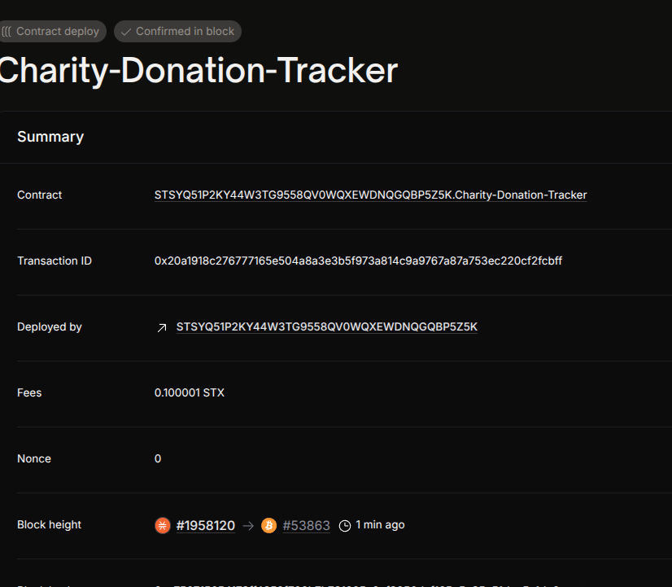

# Project Title
Charity Donation Tracker

## Project Description
A smart contract to track donations transparently on the blockchain. Donors can send funds, and all donations are recorded on-chain, allowing anyone to verify total contributions by each donor.

## Project Vision
To increase transparency and trust in charitable donations by leveraging blockchain technology for immutable record-keeping and easy public verification.

## Future Scope
- Add multiple charity accounts and fund allocation tracking
- Implement withdrawal functions for charity owners
- Include donation milestones and reward mechanisms
- Support recurring donations and donor profiles

## Contract Address
STSYQ51P2KY44W3TG9558QV0WQXEWDNQGQBP5Z5K.Charity-Donation-Tracker
